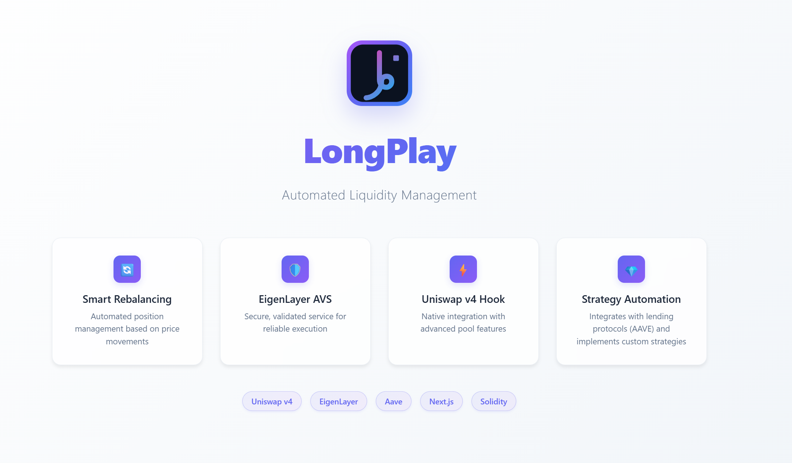
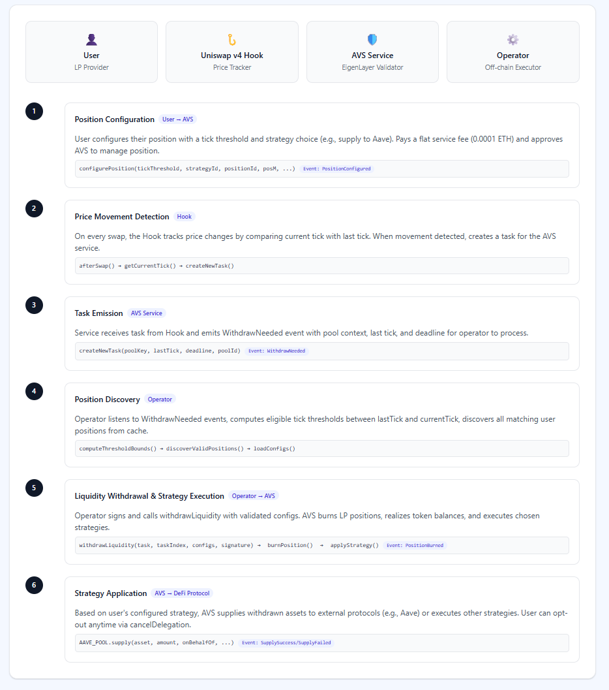

## Architecture Overview



This project connects a Uniswap v4 Hook with an EigenLayer-powered AVS (Actively Validated Service) to automate liquidity position management based on price movements. It consists of four main parts:

- Uniswap v4 Hook: `packages/foundry/src/LPRebalanceHook.sol`
- AVS Service Contract: `packages/avs/src/RangeExitManagerService.sol`
- Off-chain Operator: `packages/avs/operator`
- Frontend (Next.js): `packages/nextjs`

### 1) Price tracking and task creation (Hook → Service)

The Hook tracks price changes on every swap. On each `_afterSwap`, it computes the current tick, compares it with the last tick for the pool, and submits a task to the AVS service when a movement occurs.

```91:118:packages/foundry/src/LPRebalanceHook.sol
function _afterSwap(address, PoolKey calldata key, SwapParams calldata, BalanceDelta, bytes calldata)
    internal
    override
    returns (bytes4, int128)
{
    (, int24 currentTick,,) = poolManager.getSlot0(key.toId());
    int24 lastTick = lastTicks[key.toId()];
    lastTicks[key.toId()] = currentTick;

    if (address(service) == address(0)) {
        emit ServiceNotSet();
    }

    if (address(service) != address(0)) {
        uint256 deadline = block.timestamp + TASK_DEADLINE;
        IRangeExitServiceManager.PoolKeyCustom memory poolKeyCustom = IRangeExitServiceManager.PoolKeyCustom({
            currency0: Currency.unwrap(key.currency0),
            currency1: Currency.unwrap(key.currency1),
            fee: key.fee,
            tickSpacing: key.tickSpacing,
            hookAddress: address(this)
        });
        PoolId poolId = key.toId();
        service.createNewTask(poolKeyCustom, lastTick, deadline, poolId);
    }

    return (this.afterSwap.selector, 0);
}
```

The Hook also exposes helpers like `getUsableTick` for aligning user thresholds to tick spacing and `getCurrentTick` for the operator.

### 2) AVS service contract: configuration, task emission, execution

Users opt-in by configuring their position on the AVS contract. A flat service fee funds gas for future operations.

```97:129:packages/avs/src/RangeExitManagerService.sol
function configurePosition(
    int24 tickThreshold,
    StrategyId strategyId,
    uint256 positionId,
    address posM,
    int24 tickSpacing,
    address currency0,
    address currency1
) external payable returns (UserConfig memory) {
    require(msg.value >= SERVICE_FEE, "Insufficient service fee");
    // ... validations ...
    int24 tickThresholdToUse = HOOK.getUsableTick(tickThreshold, tickSpacing);
    UserConfig memory config = UserConfig({
        tickThreshold: tickThresholdToUse,
        strategyId: uint8(strategyId),
        owner: msg.sender,
        positionId: positionId,
        posM: posM
    });
    userConfigs[positionId] = config;
    isPositionManaged[positionId] = true;
    emit PositionConfigured(tickThresholdToUse, positionId, config);
    return config;
}
```

Default service fee is set during initialization:

```77:85:packages/avs/src/RangeExitManagerService.sol
function initialize(address initialOwner, address _rewardsInitiator, address _hookAddress, address _aavePoolAddress)
    external
    initializer
{
    __ServiceManagerBase_init(initialOwner, _rewardsInitiator);
    HOOK = ILPRebalanceHook(_hookAddress);
    AAVE_POOL = IPool(_aavePoolAddress);
    SERVICE_FEE = 0.0001 ether;
}
```

When the Hook signals a price move, the service emits a task via `createNewTask`, which the operator will consume:

```143:157:packages/avs/src/RangeExitManagerService.sol
function createNewTask(PoolKeyCustom calldata poolKey, int24 lastTick, uint256 deadline, bytes32 poolId)
    external
    onlyHook
    returns (bytes32)
{
    Task memory task = Task({
        poolKey: poolKey,
        lastTick: lastTick,
        deadline: deadline,
        createdBlock: uint32(block.number)
    });
    bytes32 thash = keccak256(abi.encode(task));
    allTaskHashes[latestTaskNum] = thash;
    emit WithdrawNeeded(task, latestTaskNum, poolKey, lastTick, deadline, poolId);
    latestTaskNum = latestTaskNum + 1;
    return thash;
}
```

The operator later calls `withdrawLiquidity` with validated user configs. The contract burns liquidity, realizes token balances, and applies the selected strategy (e.g., supplying to Aave):

```159:226:packages/avs/src/RangeExitManagerService.sol
function withdrawLiquidity(Task calldata task, uint32 taskIndex, UserConfig[] calldata configs, bytes calldata signature)
    external
    onlyOperator
{
    // ... task verification & signature checks ...
    emit PositionsModificationRequested(thash, configs.length);
    // Iterate configs → burn position → applyStrategy
}
```

```305:339:packages/avs/src/RangeExitManagerService.sol
function applyStrategy(UserConfig memory userConfig, address currency0, address currency1, uint256 b0Before, uint256 b1Before) internal {
    uint256 r0 = IERC20(currency0).balanceOf(address(this)) - b0Before;
    uint256 r1 = IERC20(currency1).balanceOf(address(this)) - b1Before;
    // Asset0ToAave / Asset1ToAave branches → Aave supply with SafeERC20
}
```

Users can opt-out at any time:

```287:299:packages/avs/src/RangeExitManagerService.sol
function cancelDelegation(uint256 positionId, address posM) external {
    address owner = IPositionManagerMinimal(posM).ownerOf(positionId);
    require(owner == msg.sender, "Only position owner");
    emit DelegationCancelled(owner, positionId, 0);
    isPositionManaged[positionId] = false;
    userConfigs[positionId] = UserConfig({ tickThreshold: 0, strategyId: uint8(StrategyId.None), owner: address(0), positionId: 0, posM: address(0) });
}
```

### 3) Off-chain operator: reacting to tasks and executing strategies

The off-chain operator is responsible for reacting to on-chain events emitted by the AVS contract.
As part of the core flow, the operator listens for `WithdrawNeeded`, computes the range of eligible `tickThreshold`s between `lastTick` and the current tick, queries configs, and executes `withdrawLiquidity` with all valid positions.

```352:404:packages/avs/operator/index.ts
rangeExitManagerService.on(
  "WithdrawNeeded",
  async (task, taskIndex, poolKey, lastTick, deadline, poolId) => {
    const currentTick = await hook["getCurrentTick(bytes32)"](poolId);
    const tickSpacing = Number((poolKey && (poolKey.tickSpacing ?? poolKey[3])) ?? 0);
    const { min, max, empty } = computeThresholdBounds(Number(currentTick), Number(lastTick), tickSpacing);
    if (empty) return;
    const discovered = await discoverValidPositions(min, max);
    // merge with pending, load configs, then sign and respond
    await signAndRespondToTask(normalizeTaskFromEvent(task), taskIndex, configs);
  }
);
```

The operator also caches user configs when positions are configured and cleans up on delegation cancellation and burns.
Currently the operator uses a centralized database to manage data which can be replaced with a decentralized storage solution to ensure data integrity and availability.

### 4) Frontend integration

The frontend surfaces a simple "Configure" action that calls the AVS contract to opt-in. The hook returns a `UserConfig` so the UI can show the active strategy and threshold. See `packages/nextjs/hooks/useConfigurePosition.ts`.

Example (simplified) configure call:

```ts
const { request, result } = await simulateContract(wagmiConfig, {
  address: avsContract.address,
  abi: avsContract.abi,
  functionName: "configurePosition",
  args: [tickThreshold, strategyId, BigInt(positionId), posM.address],
  account: address,
  value: SERVICE_FEE,
});
await writeContract(wagmiConfig, request);
```

The UI then displays configuration details on each position card (strategy label, tick threshold, etc.).

### End-to-end flow

1. User configures position on the AVS contract (paying a flat fee) and approves the AVS to manage the position.
2. Hook detects price movement on swap → calls `service.createNewTask`.
3. Service emits `WithdrawNeeded(task, ...)` with pool context and `lastTick`.
4. Operator receives the event, derives eligible thresholds, fetches matching user configs, signs, and calls `withdrawLiquidity(task, taskIndex, configs, signature)`.
5. Service validates the task and signatures, burns liquidity, applies the strategy (e.g., supply Asset0/Asset1 to Aave), and emits per-position events.
6. User can opt-out any time via `cancelDelegation`.

#### Future improvements

1. User-specific notifications for key events like `PositionBurned` and `SupplySuccess`/`SupplyFailed`. These can be sent via a pre-configured communication channel, e.g., a messenger, an email, etc.
2. Adding more strategies, such as Rebalancing or combining Aave Supply with reopening the position on a new price range to maximize earned fees.
3. Improving off-chain data integrity and availability. One option would be to replace Redis with a decentralized storage solution. Another option would be to add a reliability layer to the operator responsible for the backup/restore and retry logic.
4. Integrate a public API (e.g., a subgraph) to allow users to view their positions for quick access and monitoring/management.
5. Ensure native ETH support for Aave strategies.
